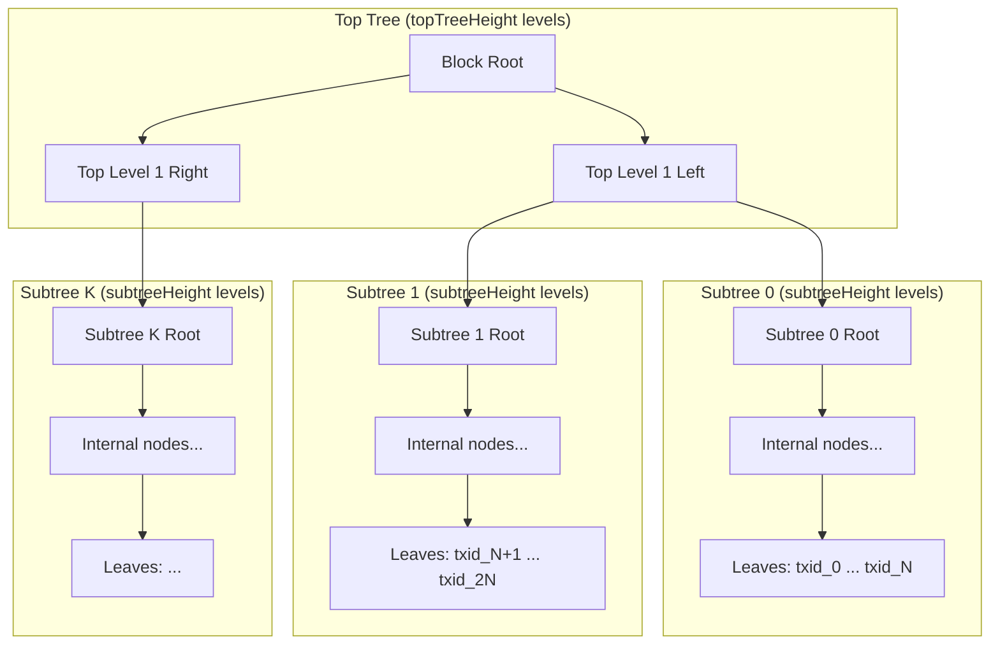
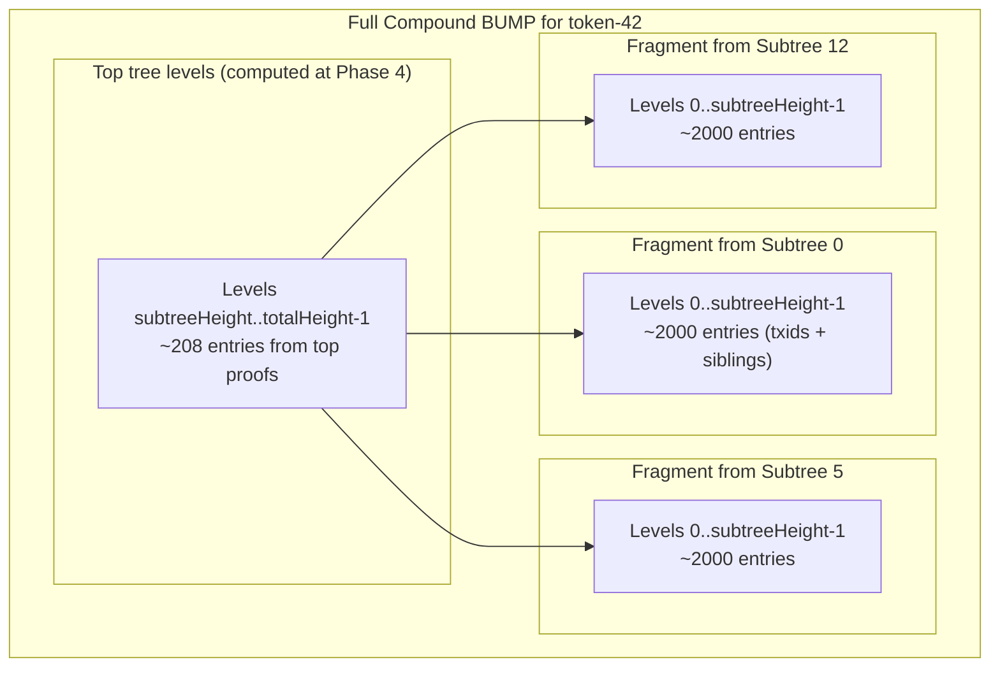
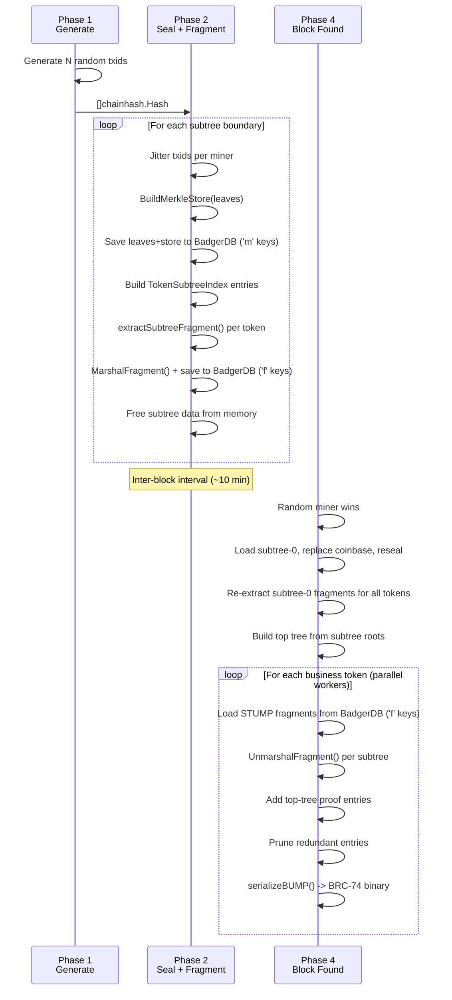

# STUMPT Architecture

**S**ubTree **U**nified **M**erkle **P**ath **T**esting

## Terminology

| Term | Meaning |
|------|---------|
| **BUMP** | Bitcoin UTXO Merkle Path (BRC-74). A compact binary proof that one or more txids are included in a block. |
| **Compound BUMP** | A single BUMP covering all of a business's txids. Shared intermediate nodes are pruned. |
| **Subtree** | A fixed-size partition of the block's transactions (default: 1M leaves). Each subtree has its own merkle tree. |
| **STUMP** | **S**ub**T**ree **U**nified **M**erkle **P**ath. A pre-computed fragment of a compound BUMP covering one token's txids within one subtree. |
| **Fragment** | Serialized STUMP data stored to disk (~82 KB). Contains deduped BUMP entries for subtree levels only. |
| **Top tree** | The merkle tree built from subtree roots. Stitches subtrees together into the full block merkle tree. |
| **Token** | A business identifier. Each txid maps to exactly one token via `uint64(txid[:8]) % NumBusinesses`. |

---

## Merkle Tree Structure

A block's merkle tree is split into two tiers: **subtrees** (bottom) and a **top tree** (top).



**Height arithmetic:**
- `subtreeHeight = log2(HashesPerSubtree)` — e.g., 20 for 1M leaves
- `topTreeHeight = log2(NumSubtrees)` — e.g., 8 for 208 subtrees
- `totalHeight = subtreeHeight + topTreeHeight` — e.g., 28

---

## What a STUMP Fragment Contains

A STUMP fragment stores the **subtree-level portion** of a compound BUMP for one token in one subtree. It contains BUMP entries at levels 0 through subtreeHeight-1.



At Phase 4, fragments are loaded from disk, concatenated across subtrees, top-tree entries are added, entries are pruned and sorted, then serialized to BRC-74 binary.

---

## Storage Map

### BadgerDB Key Prefixes

All persistent data lives in a single BadgerDB instance with key-prefix namespacing:

| Prefix | Name | Key Format | Value | Size per entry |
|--------|------|-----------|-------|----------------|
| `'m'` | MinerSubtreeStore | `'m'` + minerIdx(4B BE) + subtreeIdx(4B BE) + type(1B) | Flat `[]byte` of hashes | Leaves: 32 MB, Store: 32 MB |
| `'f'` | FragmentStore | `'f'` + minerIdx(4B BE) + tokenIdx(4B BE) + subtreeIdx(4B BE) | Serialized STUMP fragment | ~82 KB |
| `'s'` | DiskStumpStore | `'s'` + XOR_key(32B) + sequence(8B) | Marshaled stump.Entry | Variable (legacy, not in hot path) |

### MinerSubtreeStore (`'m'` prefix)

Stores raw subtree data for all miners. Two entries per (miner, subtree):

| Key | Value |
|-----|-------|
| `m \| miner(4B) \| subtree(4B) \| 'L'` | Leaves: `[]chainhash.Hash` as flat bytes (N x 32B) |
| `m \| miner(4B) \| subtree(4B) \| 'S'` | Store: `[]chainhash.Hash` as flat bytes (internal merkle nodes) |

**Written:** Phase 2 (subtree sealing)
**Read:** Phase 4 coinbase reseal (subtree-0 only), JIT fallback path

### FragmentStore (`'f'` prefix)

Stores pre-computed STUMP fragments per (miner, token, subtree):

| Key | Value |
|-----|-------|
| `f \| miner(4B) \| token(4B) \| subtree(4B)` | Serialized fragment (see format below) |

**Written:** Phase 2 (after subtree sealing), Phase 4 coinbase reseal (subtree-0 re-extraction)
**Read:** Phase 4 BUMP assembly

#### Fragment Binary Format

```
[1B numLevels]
For each level k = 0..numLevels-1:
  [4B LE numEntries]
  For each entry (sorted by offset):
    [8B LE offset]     — global tree offset at this level
    [1B flags]         — bit 1 = txid marker
    [32B hash]         — the actual hash bytes
```

Entry size: 41 bytes. Typical fragment: ~2000 entries = ~82 KB.

### In-Memory Structures

| Structure | Location | Lifetime | Size per entry | Total at 218M scale |
|-----------|----------|----------|----------------|---------------------|
| `[]chainhash.Hash` txid list | Phase 1-2 | Freed after Phase 2 | 32 B | ~7 GB |
| `TokenSubtreeIndex` (all miners) | Phase 2-4 | Non-winner freed at Phase 4 | ~10 B/miner | ~6.5 GB (3 miners) |
| `TokenSubtreeIndex` (winner only) | Phase 4 | Duration of BUMP assembly | ~10 B | ~2.2 GB |
| `workerState` (per worker) | Phase 4 | Reused across tokens | ~1 MB | ~12 MB (12 workers) |

### TokenSubtreeIndex

```
map[string]map[int][]int32
     token  subtreeIdx  localIdxs
```

Maps `(token, subtreeIdx) -> []int32` of local leaf positions within that subtree for that miner's ordering. Used to know which fragments to load and which subtrees a token spans.

---

## Pipeline Flow



---

## BUMP Assembly: Fragment Path vs JIT Path

### Fragment Path (default when FragmentStore available)

```
For each token:
  1. Look up subtree indices from TokenSubtreeIndex
  2. Load pre-computed fragment (~82 KB) from BadgerDB for each subtree
  3. Deserialize into per-level bumpEntry slices
  4. Concatenate entries across all subtrees at each level
  5. Add top-tree entries using pre-computed top proofs
  6. Sort each level by offset
  7. Prune: remove level-h entry if both children present at h-1
  8. Serialize BRC-74 binary via serializeBUMP()
```

### JIT Fallback Path (when FragmentStore is nil)

```
For each token:
  1. Look up subtree indices + local positions from TokenSubtreeIndex
  2. Load full subtree (~64 MB leaves+store) from BadgerDB with LRU cache
  3. Walk merkle store with bitset dedup to extract entries per level
  4. Add top-tree entries
  5. Sort, prune, serialize
```

---

## BRC-74 BUMP Binary Format

The final output format (written by `serializeBUMP()`):

```
[VarInt blockHeight]
[1B treeHeight]
For each level 0..treeHeight-1:
  [VarInt numEntries]
  For each entry (sorted by offset):
    [VarInt offset]
    [1B flags]        — bit 0: duplicate (hash omitted), bit 1: txid
    [32B hash]        — omitted if duplicate flag set
```

VarInt encoding (Bitcoin standard):
- 0-252: 1 byte
- 253-65535: `0xfd` + 2 bytes LE
- 65536-2^32: `0xfe` + 4 bytes LE
- 2^32+: `0xff` + 8 bytes LE

---

## Token Assignment

Tokens are derived deterministically from the txid itself:

```go
tokenIdx := binary.LittleEndian.Uint64(txid[:8]) % uint64(NumBusinesses)
token := fmt.Sprintf("token-%d", tokenIdx)
```

This gives:
- **Uniform random distribution** across tokens (txids are crypto-random)
- **Order-independent** — same result regardless of which miner's ordering
- **No additional storage** — computed on the fly from the txid bytes

---

## Key Size Calculations at 218M Txids / 1000 Businesses / 208 Subtrees

| What | Count | Per-entry size | Total |
|------|-------|----------------|-------|
| Subtree data (leaves+store, per miner) | 208 subtrees x 3 miners | ~64 MB | ~40 GB |
| STUMP fragments (per miner) | 208 subtrees x 1000 tokens x 3 miners | ~82 KB | ~51 GB |
| TokenSubtreeIndex (per miner) | 218M entries x 3 miners | ~10 B | ~6.5 GB (memory) |
| Phase 1 txid list | 218M | 32 B | ~7 GB (memory, freed after P2) |
| Top tree proofs | 208 subtrees | ~7 KB | ~1.5 MB |
| **Total disk** | | | **~91 GB** |
| **Peak memory (Phase 2)** | | | **~17 GB** |
| **Peak memory (Phase 4)** | | | **~2.5 GB** |
